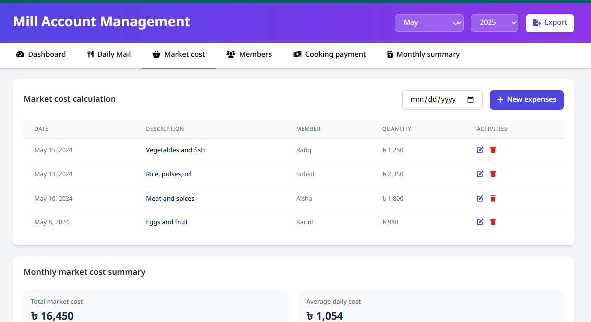

# Meal Management System UI Design (Tailwind CSS)

**Live Preview:** [Click Here](https://arefin201.github.io/meal_management_system/)

## Overview

This project is a **responsive Meal Management System UI Design** built using **Tailwind CSS**. 
It is specially designed to help manage daily meals in Bachelor houses, Messes, 
or Hostels where shared meal cost tracking and member contributions are essential.

## Key Features

- Fully responsive modern UI
- Minimal and user-friendly layout
- Built with Tailwind CSS utility classes
- Designed specifically for Bachelor Mess/Mill Management
- Sections include:
  - Dashboard Overview
  - Meal Entry and Member List
  - Bazar Cost Tracking
  - Monthly Summary/Report
  - Notice Board (Optional Placeholder)

## Target Users

This design is particularly useful for:
- Bachelor houses
- Student messes/hostels
- Shared accommodations
- Small family-based kitchens

## Tools Used

- **Tailwind CSS** (no JavaScript yet)
- HTML5
- Tailwind CSS
- JavaScript (Vanilla)
- Responsive Design Principles
- Manual frontend structuring and styling


## 📸 Preview Screenshots

### Dashboard
  

### Member Management


### Market Summary



## How to Use

1. Clone or download the repository:
   ```bash
   git clone https://github.com/arefin201/meal_management_system/
